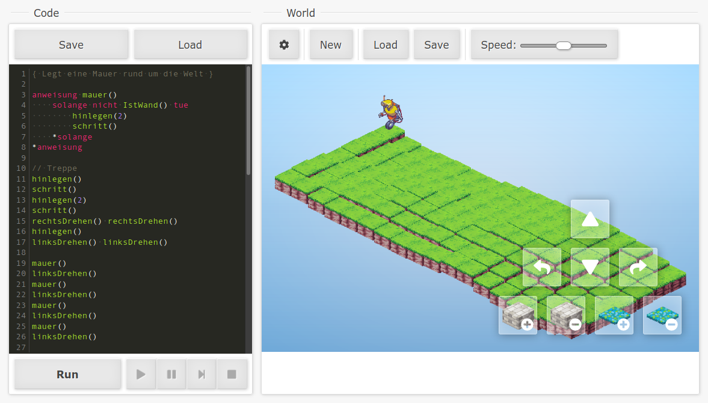

# Karol / Phinn*
* Currently Karol, may be renamed to Phinn later

> Karel is an educational programming language for beginners […]

source: [Wikipedia](https://en.wikipedia.org/wiki/Karel_(programming_language))

It was updated in a German version called [Robot Karol](https://de.wikipedia.org/wiki/Robot_Karol) which is used in many schools. However both compatibility and usability are rather outdated at this point.  
This project is a browser based interpretation of the same language and concept, with
updated graphics and potential for future expansion.

## Usage: Go to [**`philer.org/karol`**](https://philer.org/karol) 👆

The [**live version**](https://philer.org/karol) can be used in schools or at home.

For more configuration options or when no Internet connection is available, you can also download a [release](https://github.com/philer/karol/releases).  
Inside you will find an `index.html` file, which you can open in a browser. It should just work. If it doesn't, try a different browser.

### Configuration

Configuration is stored in `config.js`.  
Translation files are stored in `localization/`.  
Additionally, sprite themes are located in `img/`. Each theme has a `theme.js` which defines the exact sprites used.

### Compatibility

Current targets are up-to-date Firefox and Chrome. It probably works in latest Edge, too.

## Development

Dependencies and build tools are managed via `yarn` or `npm`. The following uses `yarn`, `npm` has mostly the same syntax.

1. Run `yarn` (or `npm install`) to install all development dependencies.
2. Run `yarn build` to build the bundles and `yarn dist` to generate minified bundles for production.
3. While editing use `yarn watch` for automatic bundle building. *Note: `index.html` links minified files by default.*
4. Run `yarn lint` to check syntax.

Check `package.json` for more commands under the `scripts` key.

### Future plans & ideas

* [ ] Fully configurable localization of key words and builtins
* [ ] Resizable layout
* [ ] About page, Credits page, Help page, Changelog
* [ ] Compass rose
* [ ] Rendering optimization (hopefully with animations)
* [ ] More/better sprites
* [ ] Extended world format for more block types
* [ ] fast/slow/instant key words
* [ ] Recording feature
* [ ] Fullscreen, Screenshot
