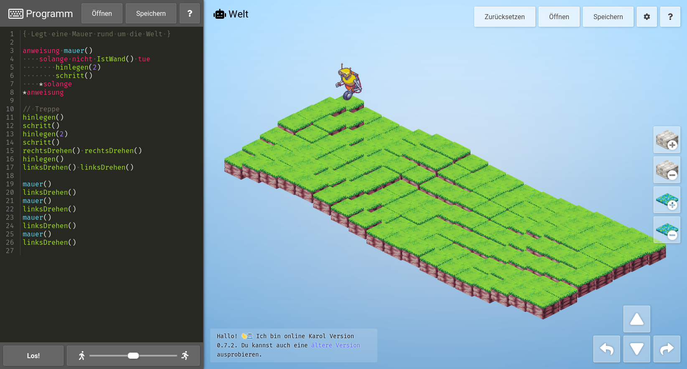

# Karol / Phinn*
* Currently Karol, may be renamed to Phinn later

„Karel is an educational programming language for beginners…“[ (Wikipedia)](https://en.wikipedia.org/wiki/Karel_(programming_language)) It was updated in a German version called [Robot Karol](https://de.wikipedia.org/wiki/Robot_Karol) which is used in many schools. However both compatibility and usability are rather outdated at this point.
This project is a browser based interpretation of the same language and concept, with
updated graphics and potential for future expansion.

## Usage: Go to [👉 philer.org/karol](https://philer.org/karol) or…

Install it locally for more configuration options and offline usage by downloading a [release](https://github.com/philer/karol/releases). After unpacking the ZIP archive you will find an `index.html` file, which you can open in a browser. It should just work. If it doesn't, try a different browser.

### Configuration

Configuration is stored in `config.js`.
Translation files are stored in `localization/`.
Additionally, sprite themes and syntax highlighting themes are located in `themes/`.
Each sprite theme has a `theme.js` which defines the exact sprites used.

### Compatibility

Current targets are up-to-date Firefox and Chrome. It probably works in latest Edge, too.
Mobile Safari may have some glitches and should be improved in the future.

## Development

Dependencies and build tools are managed via `yarn` or `npm`. The following uses `yarn`, `npm` has mostly the same syntax.

1. Run `yarn` (or `npm install`) to install all development dependencies.
2. Run `yarn dist` to generate a production bundle.
3. … or run `yarn dev` to start a development server with automatic reload while working on code.
4. Run `yarn typecheck` to check code, `yarn lint` to check formatting and `yarn test` to run tests.

Check `package.json` for more commands under the `scripts` key.
